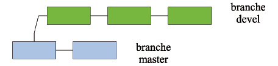
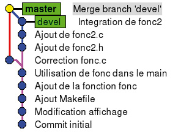
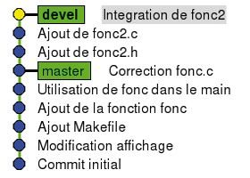
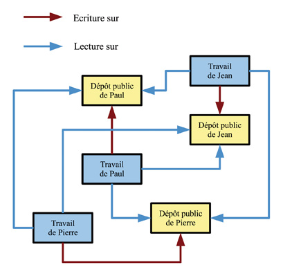

% Git it
% William Daniau
% Mis en ligne le : 15/03/2010 in GNU/Linux Magazine

# Résumé

Dans cet article, nous abordons l’utilisation de Git, le
gestionnaire de version écrit par Linus Torvalds et utilisé pour le
développement du noyau Linux. Le but recherché est de donner le
nécessaire pour commencer à utiliser Git tout de suite, par une approche
pas à pas. On suppose que tous les paquets Git sont déjà installés sur
la machine.

# Introduction

Git a la réputation d’être complexe à utiliser. C’est à la fois vrai et
faux. Git est un outil extrêmement puissant et l’utilisation qu’en fait
quelqu’un qui le connaît bien peut rapidement apparaître obscur.
Néanmoins, on peut tout à fait utiliser Git au jour le jour très
simplement avec quelques commandes de base une fois qu’on en a saisi les
principes. Git [1] est un SCM (Source Code Management), un gestionnaire
de version de fichiers comme CVS ou Subversion qui sont les plus connus,
mais il en existe d’autres comme Mercurial. Ce type de logiciel est
habituellement utilisé par les développeurs afin de garder un historique
des différentes versions de leurs sources et tout particulièrement par
les groupes de développeurs travaillant sur un même projet. Néanmoins,
un SCM peut être avantageusement utilisé pour n’importe quel type de
fichiers (Latex par exemple), par des utilisateurs isolés ou non. Un
petit exemple pour comprendre à quoi peut servir un SCM : il est arrivé
à tous les programmeurs, d’écrire un bout de code, de se dire " c’est
nul ", de l’effacer pour réécrire la fonction, puis de se dire " hum,
finalement ma première version était pas si mal... ", ou encore de faire
une copie fonction.c.sav et au bout d’un mois de développement de se
retrouver avec dans le répertoire : fonction.c.sav, fonction.c.sav2,
fonction.c.old, etc. sans plus trop savoir à quoi tous ces fichiers
correspondent ! Avec un (bon) SCM (avec Git par exemple :)), on aurait
pu revenir immédiatement à la première version de notre fonction et tout
simplement éviter les multiples copies. On a un historique complet du
travail et bien plus encore. Le but de ce tutoriel est de fournir les
bases par une approche pas à pas pour pouvoir commencer à utiliser Git.

# Deux lignes d’histoire

Git a été développé par Linus Torvalds (est-il besoin de le présenter ?)
depuis 2005, rejoint ensuite par de nombreux contributeurs. Linus
utilisait un logiciel commercial nommé Bitkeeper [2] dont la licence
permettait l’utilisation gratuite pour des développements libres. Cette
licence a changé en 2005 et, comme aucun des SCM existants ne lui
convenait, Linus a décidé d’écrire Git. À la différence de CVS et
Subversion (que Linus déclare haïr passionnément), Git n’utilise pas de
dépôt centralisé. Il s’agit d’un système distribué où aucun dépôt n’est
prioritaire sur les autres.

# Travail en solo

## De la lecture

Avant toute chose, Git est très bien documenté (pour ceux qui
comprennent l’anglais). Le site web [1] regorge de documentation, de
tutoriaux et notamment d’une excellente présentation vidéo [3] par Bart
Trojanowski. Les pages de manuel ne sont pas en reste et sont très
détaillées. Sachant qu’une commande Git se présente sous la forme git
commande, on pourra afficher la page de manuel correspondante de
différentes manières : man git-commande ou git help commande.

## Réglages

Dans Git, chaque opération effectuée est enregistrée avec le nom et
l’email de l’opérateur. Avant de commencer à travailler, nous allons
donc indiquer à Git ces informations d’une manière globale, ce qui, dans
mon cas, donne :

    $ git config --global user.name "William Daniau"
    $ git config --global user.email william.daniau@femto-st.fr

Certaines opérations lancent un éditeur de texte qui, par défaut, est
vi1. Si vous êtes allergiques à vi, spécifiez également votre éditeur
préféré. De même, quand Git vous visualise un fichier, il utilise un
pager qui par défaut est less. Vous pouvez changer ce choix par défaut
ou modifier les paramètres de less2:

    $ git config --global core.editor kate
    $ git config --global core.pager "less -FSRX"

Ces informations sont écrites dans le fichier .gitconfig sous la racine
de l’utilisateur. À noter que chaque dépôt pourra avoir sa propre
configuration spécifique (stockée dans .git/config). L’ensemble des
paramètres configurables est détaillé dans man git-config.

## Premier dépôt

Nous pouvons maintenant commencer à travailler. En supposant que nous
commençons un nouveau projet, nous allons créer un dossier de travail et
initialiser Git dans ce dossier :

    $ mkdir tuto
    $ cd tuto
    $ git init
    Initialized empty Git repository in /home/daniau/Programmation/git-tuto/tuto/.git/

À partir de là, nous avons un dossier .git dans notre répertoire projet.
C’est lui qui constitue à proprement parler le dépôt. Le reste du
contenu du répertoire projet constituera la copie de travail. Nous
commençons notre travail proprement dit (ici l’écriture d’un programme
C). Nous avons maintenant dans le dossier plusieurs fichiers :

    $ ls
    hello  hello.c  hello.c\~

hello.c le fichier source, hello.c\~ un fichier de backup laissé là par
mon éditeur, et le programme compilé hello.

Il est temps pour nous d’effectuer notre première livraison au dépôt
Git. Avant cela, entrons la commande git status, commande très utile à
utiliser fréquemment fournissant des informations sur ce que Git sait :

    $ git status
    # On branch master
    #
    # Initial commit
    #
    # Untracked files:
    #   (use "git add \<file\>..." to include in what will be committed)
    #
    #       hello
    #       hello.c
    #       hello.c\~
    nothing added to commit but untracked files present (use "git add" to track)

Git nous dit donc qu’il n’a rien à faire, mais qu’il a détecté nos
3 fichiers qu’il ne gère pas. Ce qui nous intéresse ici, c’est de suivre
l’évolution de nos sources. Nous allons donc dire à Git de gérer
hello.c, puis de nouveau faire un git status :

    $ git add hello.c
    $ git status
    # On branch master
    #
    # Initial commit
    #
    # Changes to be committed:
    #   (use "git rm --cached \<file\>..." to unstage)
    #
    #       new file:   hello.c
    #
    # Untracked files:
    #   (use "git add \<file\>..." to include in what will be committed)
    #
    #       hello
    #       hello.c\~

Nous voyons que maintenant Git sait qu’il doit gérer le fichier hello.c.
Néanmoins, pour l’instant, rien n’est enregistré, ce que nous avons fait
avec l’instruction git add, c’est mettre à jour l’index de Git. C’est
une notion importante de Git. L’index contient ce qu’il va falloir
enregistrer, opération que nous allons effectuer par l’instruction git
commit qui va nous lancer un éditeur de texte avec le texte suivant :

    # Please enter the commit message for your changes. Lines starting
    # with ‘#’ will be ignored, and an empty message aborts the commit.
    # On branch master
    #
    # Initial commit
    #
    # Changes to be committed:
    #   (use "git rm --cached \<file\>..." to unstage)
    #
    #       new file:   hello.c
    #
    # Untracked files:
    #   (use "git add \<file\>..." to include in what will be committed)
    #
    #       hello
    #       hello.c\~

On voit que le texte du git status est répété ici et qu’on nous demande
d’entrer un message, les lignes commençant par # étant ignorées. Entrer
un message non vide pour chaque commit est obligatoire avec Git. Git
annulera le commit si aucun message n’est entré. Entrez donc un texte,
sauvegardez et quittez l’éditeur. La sortie est alors :

    $ git commit
    [master (root-commit) cc099bb] Commit initial
     1 files changed, 6 insertions(+), 0 deletions(-)
     create mode 100644 hello.c

Entrons maintenant une autre commande très utile, git log :

    $ git log
    commit cc099bb40529df437b2b0e90c7111a866fc6a0a5
    Author: William Daniau \<william.daniau@femto-st.fr\>
    Date:   Thu May 7 14:21:58 2009 +0200
        Commit initial

Cette instruction va lister tous les enregistrements qui ont été
effectués. On y trouve les éléments suivants :

- un identifiant unique du commit ici
cc099bb40529df437b2b0e90c7111a866fc6a0a5 (il s’agit en fait d’une somme
SHA1) ;

- l’auteur du commit ;

- la date du commit ;

- le commentaire entré lors du commit, ici : Commit initial.

Continuons à travailler sur notre projet. Le fichier hello.c a été
modifié et on souhaite maintenant enregistrer ces modifications dans le
dépôt. Nous faisons tout naturellement un git commit :

    $ git commit
    # On branch master
    # Changed but not updated:
    #   (use "git add \<file\>..." to update what will be committed)
    #   (use "git checkout -- \<file\>..." to discard changes in
    working directory)
    #
    #       modified:   hello.c
    #
    # Untracked files:
    #   (use "git add \<file\>..." to include in what will be committed)
    #
    #       hello
    #       hello.c\~
    #       hello.o
    no changes added to commit (use "git add" and/or "git commit -a")

Eh oui, il n’y a rien à committer (désolé pour ce verbe franglais que
j’utiliserai abondamment dans la suite). Git a bien identifié qu’un des
fichiers qu’il suit a été modifié et qu’il y a des fichiers non suivis,
mais considère qu’il n’y a rien à faire dans ce commit. En effet, lors
d’un git commit, ce qui est committé, c’est le contenu de l’index (que
l’on peut voir avec git status). Il faut donc en fait systématiquement
refaire un git add sur les fichiers que l’on souhaite committer, ce qui
va les ajouter à l’index, puis faire le git commit. L’autre solution
consiste à utiliser git commit –a. L’option -a fait implicitement un git
add sur tous les fichiers suivis par Git et modifiés. C’est en général
le comportement qu’on souhaite. Dans notre cas, on pourra avec le même
résultat faire

    $ git add hello.c
    $ git commit

ou bien :

    $ git commit -a

Notons également maintenant la possibilité d’entrer le message de commit
directement sur la ligne de commande avec l’option -m :

    $ git commit -a -m "Modification affichage"
    [master cb8144f] Modification affichage
     1 files changed, 1 insertions(+), 1 deletions(-)

Il est temps maintenant de voir à quoi cela va pouvoir nous servir en
pratique. Pour cela, nous allons faire quelques modifications
(modifications sources, ajout de fichiers, etc.), de manière à avoir au
moins 5 commits dans le log :

    $ git log
    commit 374611086aca946fadcc8d5491b9ee734e2f1b3c
    Author: William Daniau \<william.daniau@femto-st.fr\>
    Date:   Sat May 9 11:38:18 2009 +0200
        Utilisation de fonc dans le main
    commit 7ee6dc1424025781ff1f7378e03d4cbd0e11da84
    Author: William Daniau \<william.daniau@femto-st.fr\>
    Date:   Sat May 9 11:34:48 2009 +0200
        Ajout de la fonction fonc
    commit 5e6901b5334de30d650788548143a459fbf1c31f
    Author: William Daniau \<william.daniau@femto-st.fr\>
    Date:   Sat May 9 11:26:27 2009 +0200
        Ajout Makefile
    commit cb8144f5c6198149c4cf97918438191a80401c03
    Author: William Daniau \<william.daniau@femto-st.fr\>
    Date:   Fri May 8 14:17:46 2009 +0200
        Modification affichage
    commit cc099bb40529df437b2b0e90c7111a866fc6a0a5
    Author: William Daniau \<william.daniau@femto-st.fr\>
    Date:   Thu May 7 14:21:58 2009 +0200
        Commit initial

Avant de passer à la suite, nous allons voir comment dire à Git
d’ignorer complètement certains fichiers et de ne pas même nous signaler
qu’ils sont untracked. On va indiquer dans un fichier soit un format de
fichier, soit un nom explicite de fichier à ignorer. Le fichier dans
lequel on indique cela sera soit un fichier .gitignore dans la racine de
la copie de travail qui sera en général ajouté lui-même au dépôt, soit
dans le fichier .git/info/exclude. Par exemple, le fichier :

    \*\~
    \*.o
    hello

exclut les fichiers de backup de l’éditeur, les fichiers objet et le
programme compilé.

## Annuler un commit : git revert

Imaginons que ce qui a été fait lors du second commit Modification
affichage ne soit finalement pas souhaitable. On aimerait annuler ce qui
a été fait à ce moment-là tout en gardant les autres modifications. Ceci
est réalisé par l’instruction git revert, qui crée un nouveau commit en
annulant un autre :

    $ git revert cb8144f5c6198149c4cf97918438191a80401c03
    Automatic revert failed.  After resolving the conflicts,
    mark the corrected paths with ‘git add \<paths\>’ or ‘git rm \<paths\>’ and commit the result.

Dans la plupart des cas, tout va se passer de manière automatique, mais
il y a des cas où Git ne sait pas décider à coup sûr de l’opération à
effectuer, comme dans le cas présent. Faisons un git status :

    $ git status
    hello.c: needs merge
    # On branch master
    # Changed but not updated:
    #   (use "git add \<file\>..." to update what will be committed)
    #   (use "git checkout -- \<file\>..." to discard changes in working directory)
    #
    #       unmerged:   hello.c
    #
    ...

Nous voyons que notre fichier hello.c a besoin d’un merge. Éditons-le :

    #include \<stdio.h\>
    #include "fonc.h"
    main()
    {
    \<\<\<\<\<\<\< HEAD:hello.c
    int i;
    i=1;
    printf("Hello World\\n");
    printf("%d,%d\\n",i,fonc(i));
    =======
    printf("Hello\\n");
    \>\>\>\>\>\>\> cb8144f... Modification affichage:hello.c

Git n’ayant pas pu faire la modification seul, il nous a mis dans notre
fichier hello.c les deux versions. En premier, celle correspondant au
HEAD, c’est-à-dire la version du dernier commit, puis à la version
précédant le commit qu’on souhaite annuler. Le commit Modification
affichage transformait en effet le printf("Hello\\n"); en printf("Hello
World\\n");. Il nous suffit donc de modifier en conséquence le fichier
hello.c, de faire git add hello.c et enfin git commit :

    $ git add hello.c
    $ git commit

Un message automatiquement généré par le revert est affiché. Libre à
nous de le modifier :

    Revert "Modification affichage"
    This reverts commit cb8144f5c6198149c4cf97918438191a80401c03.
    Conflicts:
            hello.c

Le conflit ayant été résolu, nous pouvons supprimer les lignes le
concernant. Dans tous les cas où le revert automatique fonctionne, on
aura évidemment rien à faire. Pourquoi un conflit sur un cas a priori
aussi simple ? Comme on a deux printf juxtaposés dans une des versions
et un seul dans l’autre, Git n’a aucun moyen de décider avec certitude
sur quel printf se situe la modification.

## table rase : git reset

Supposons maintenant que l’on se dise : " finalement, ce que j’ai fait
dans les deux derniers commits, c’est n’importe quoi ". Qu’à cela ne
tienne, l’instruction git reset est là pour ça. Elle va replacer le
dépôt au commit spécifié. Tout ce qui a été fait après sera purement et
simplement effacé :

    $ git reset 5e6901b5334de30d650788548143a459fbf1c31f
    Makefile: locally modified
    hello.c: locally modified

Que signifient ces messages ? En fait, notre instruction git reset a
bien remis à jour le dépôt, mais n’a pas touché à la copie de travail.
On pourra s’en convaincre par un simple ls dans le dossier et un git
log. C’est le comportement par défaut de l’instruction git reset. Cela
peut être utilisé pour récrire l’histoire en regroupant plusieurs
commits ! En effet, il nous suffit d’ajouter à l’index les fichiers
modifiés et les nouveaux fichiers et de faire un commit :

    $ git add Makefile hello.c fonc.c fonc.h
    $ git commit

Dans la plupart des cas, quand on fait un git reset, on souhaite que la
copie de travail reflète le dépôt. Il suffit pour cela d’ajouter
l’option --hard :

    $ git reset --hard 5e6901b5334de30d650788548143a459fbf1c31f

Et là : " Horreur ! Je me suis trompé ! Un an de boulot effacé !  " Qu’à
cela ne tienne ! Git a conservé l’état précédent accessible avec le mot
clé ORIG\_HEAD :

    $ git reset --hard ORIG\_HEAD

Si on ne spécifie pas le commit, celui qui est pris par défaut est le
dernier, désigné également par le mot-clé HEAD. L’instruction git reset
--hard est donc assez fréquemment utilisée pour effacer tous les
changements en cours dans la copie de travail.

## Autres commandes utiles : `git rm`, `git mv`, `git ls-files`, `git archive`

Si on veut supprimer un fichier du dépôt et que l’on est un adepte du
git commit -a, rien de plus simple. On efface le fichier de façon
standard et le git commit -a va repérer que le fichier a disparu et
cette modification sera prise en compte. Sinon, c’est l’instruction git
rm fichier qui va s’occuper de cette besogne. Le fichier sera effacé.
L’index mis à jour pour cet effacement qui sera donc pris en compte par
le prochain commit.

Si on souhaite renommer (ou déplacer) un fichier, il faut le spécifier à
Git par l’instruction git mv. Tout comme avec git rm, l’opération est
effectuée dans la copie de travail et l’index est mis à jour pour le
prochain commit.

    $ git mv fonc.h func.h

La commande git ls-files liste le contenu du dépôt. À noter que Git ne
gère pas les répertoires vides. Si, pour une raison quelconque, on
souhaite intégrer un répertoire vide dans le dépôt, il faudra y placer
un fichier même de taille nulle.

Une autre commande précieuse git archive vous permet de générer une
archive à partir de votre dépôt (et non de la copie de travail) :

    $ git archive --format=tar --prefix=tuto\_v1/ HEAD | gzip \> ../tuto\_v1.tar.gz

Ceci va nous générer une archive au format tar compressée par gzip dans
le répertoire parent. L’option --prefix=tuto/ permet de spécifier le nom
du répertoire qui sera créé lors de la décompression de l’archive. On
spécifie également le point de commit à partir duquel on génère
l’archive. En l’occurrence ici HEAD, mais on voit qu’il est très facile
de générer une archive issue de n’importe quel commit.

## Modifier le dernier commit

Nous avons vu comment, avec git reset, on pouvait récrire l’histoire en
regroupant plusieurs commits en un seul. Il existe une option de git
commit permettant d’ajouter les modifications au dernier commit :

    $ git log -n 1
    commit 374611086aca946fadcc8d5491b9ee734e2f1b3c
    Author: William Daniau \<william.daniau@femto-st.fr\>
    Date:   Sat May 9 11:38:18 2009 +0200
        Utilisation de fonc dans le main
    ... Modification de fichier
    $ git commit -a --amend

Le texte du commit existant est repris et éventuellement modifié. À la
fin de l’opération, on aura toujours le même nombre de commits, mais
l’identifiant du dernier aura changé (ce qui est parfaitement cohérent,
c’est tout le principe de l’identifiant unique). Par contre, la date est
conservée.

    $ git log -n 1
    commit 4f7432a1ddc0077566bd2bc52978f9e839cd7392
    Author: William Daniau \<william.daniau@femto-st.fr\>
    Date:   Sat May 9 11:38:18 2009 +0200
        Utilisation de fonc dans le main

Si ces opérations de regroupement et modifications peuvent sembler
pratiques, elles n’en sont pas moins à éviter dès lors que l’on
travaille en groupe, car le fait de récrire l’histoire peut poser de
sérieux problèmes de synchronisation entre les différents développeurs.

## Les branches

### Création

Passons maintenant à une des parties les plus intéressantes de Git : les
branches. Supposons que nous soyons satisfait de notre travail (si,
si :)), mais que nous souhaitions continuer le développement tout en
gardant notre version " stable " sous le coude pour y corriger les
éventuels bogues. Rien de plus simple avec Git, nous allons créer une
nouvelle branche de développement que nous appellerons dans notre cas
devel :

    $ git branch devel

Et... c’est tout ? Ben oui, c’est tout. Créer une branche avec Git est
aussi simple que ça. Entrons maintenant la commande sans arguments :

    $ git branch
      devel
    \* master

Git nous liste les différentes branches connues, l’étoile indiquant la
branche active. Pour changer de branche, nous allons utiliser
l’instruction git checkout avec le nom de la branche en argument :

    $ git checkout devel
    Switched to branch "devel"
    $ git branch
    \* devel
      master

La copie de travail est modifiée pour se conformer à la branche
spécifiée. Tous les commits que nous ferons seront désormais appliqués à
la branche devel. À tout moment, un git checkout master nous permettra
de revenir dans une copie de travail correspondant à la branche master.
On passe donc très facilement d’une branche à l’autre. Notons une option
utile de git checkout, l’option -f qui est un peu l’équivalent du --hard
pour git reset, à savoir qu’on va forcer tous les fichiers même s’ils
ont des modifications locales.

Nous travaillons maintenant dans notre branche devel, où nous ajoutons
quelques fonctionnalités. Entre temps, une ou deux modifications ont été
apportées à notre branche master (correction de bugs par exemple). De
sorte que l’historique de notre dépôt peut être schématisé par la
fig. 1, chaque rectangle représentant un commit dans l’une ou l’autre
branche.

À ce niveau, il y a deux opérations principales que l’on peut
effectuer : merge et rebase.

### Merge

L’opération merge consiste à faire fusionner deux branches. Typiquement,
le travail effectué dans notre branche devel est maintenant satisfaisant
et on souhaite l’appliquer à la branche master. Rien de plus simple. On
se place dans la branche master et on applique la commande git merge
devel.

    $ git checkout master
    $ git merge devel
    Merge made by recursive.
     Makefile |    2 +-
     fonc2.c  |    8 ++++++++
     fonc2.h  |    3 +++
     hello.c  |    5 +++++
     4 files changed, 17 insertions(+), 1 deletions(-)
     create mode 100644 fonc2.c
     create mode 100644 fonc2.h

Le programme gitk inclus dans la distribution Git permet un affichage
graphique de l’historique des différentes opérations effectuées sur le
dépôt. Après l’opération de fusion, on obtient la fig. 2.

Quand au devenir de notre branche devel, on peut soit la laisser en
place et s’en servir pour continuer le développement, soit décider de
l’effacer. Cela est effectué avec l’instruction :

    $ git branch -d devel

À noter que cette opération ne sera acceptée par Git qu’après un merge
réussi. Il est néanmoins possible d’effacer inconditionnellement une
branche (genre développement d’une idée complètement stupide). On
utilisera l’option -D au lieu de -d.

### Rebase

L’opération de rebase est plus subtile et très utile. Elle permet en
fait d’appliquer les modifications de la branche master à la branche de
développement. Typiquement, on a fait des corrections de bug sur la
branche stable, tandis que la branche développement suit son cours, mais
n’est pas encore prête à être fusionnée avec la branche stable. Cela
revient à replacer le point de bifurcation de la branche devel sur le
dernier commit de la branche master. On se place dans la branche devel
et on applique la commande :

    $ git checkout devel
    $ git rebase master
    First, rewinding head to replay your work on top of it...
    Applying: Ajout de fonc2.h
    Applying: Ajout de fonc2.c
    Applying: Integration de fonc2

Après cette opération, gitk nous donne l’arbre de la fig. 3.

## Et en vrac

En vrac, quelques compléments très utiles dont on n’a pas parlé
précédemment.

### Identification du commit

Tout d’abord, pour identifier un commit, on n’est pas obligé d’utiliser
le SHA1 en entier, les caractères du début suffisent pour peu qu’il n’y
ait pas d’ambiguïté. Ainsi, on pourra utiliser :

    $ git reset 5e6901b

au lieu de :

    $ git reset 5e6901b5334de30d650788548143a459fbf1c31f

On peut donner un tag, un alias à la place d’un commit donné :

    $ git tag v1.0 5e6901b5334de30d650788548143a459fbf1c31f

On pourra ensuite utiliser v1.0 à la place du SHA1.

### Checkout

Pour restaurer un fichier tel qu’il apparaît dans un commit donné :

    $ git checkout 5e6901b Makefile

Pour restaurer l’ensemble de la copie de travail à un commit donné :

    $ git checkout 5e6901b
    Note: moving to "5e6901b" which isn’t a local branch
    If you want to create a new branch from this checkout, you may do so
    (now or later) by using -b with the checkout command again. Example:
      git checkout -b \<new\_branch\_name\>
    HEAD is now at 5e6901b... Ajout Makefile

Dans ce cas-là, on se retrouve dans une branche temporaire comme nous
l’indique git branch :

    $ git branch
    \* (no branch)
      devel
      master

Il nous faudra revenir dans une branche valide pour pouvoir travailler.
Ceci dit, comme l’indique le message, il est possible de créer une
branche avec l’option -b :

    $ git checkout 5e6901b -b test
    Switched to a new branch "test"

### Log

La commande git log est extrêmement puissante. Je ne donne ici que
quelques exemples. On se référera à la page de manuel pour plus d’info :

    $ git log hello.c

Liste tous les commits ayant modifiés le fichier hello.c. Si le fichier
hello.c a été renommé au cours du temps, et qu’on ajoute l’option
-follow, on verra également les commits correspondants.

    $ git log v1.0..v2.0

Liste tous les commits entre les tags v1.0 et v2.0.

    $ git log --since="2 days ago"

Liste tous les commits ayant eu lieu depuis deux jours.

    $ git log v1.0..v2.0 --since="2 days ago" hello.c

Évidemment, on peut combiner tout ça...

# Travail collectif

## Description

L’un des intérêts d’un SCM est de pouvoir travailler à plusieurs
développeurs sur un même code. Git étant particulièrement souple, il
existe une multitude de façons de travailler. On pourrait très bien par
exemple avec Git adopter un modèle centralisé comme avec SVN, mais
bon...

À titre d’exemple, nous allons décrire une méthode de travail purement
décentralisée entre 3 développeurs Pierre, Paul et Jean. La méthode
présentée ici n’est pas LA méthode, mais UNE méthode de travail
possible. La fig. 4 schématise ce fonctionnement.

Chacun des utilisateurs possède deux dépôts, l’un représenté par une
boite bleue correspond à son répertoire de travail sur sa machine,
l’autre représenté par une boite jaune est son dépôt public accessible
en écriture pour cet utilisateur et accessible en lecture par les autres
utilisateurs. Chacun des utilisateurs va lire les dépôts publics des
autres utilisateurs afin de récupérer leur travail, et chacun met à jour
son propre dépôt public avec son travail. Comme on le voit dans cette
configuration, aucun des dépôts n’est prioritaire sur les autres, tous
sont équivalents.

## Créer et mettre à jour son dépôt public

### Création du dépôt public

Tout d’abord, voyons comment nous allons créer notre dépôt public. La
première opération consiste à créer un " clone " de son dépôt de travail
par l’opération suivante :

    $ cd ..
    $ git clone --bare tuto
    Initialized empty Git repository in /home/daniau/Programmation/git-tuto/
    tuto.git/

On se place en dehors du dépôt, et l’instruction git clone va nous créer
une copie de ce dépôt. L’option --bare permet de créer une copie ne
contenant que les informations du dossier tuto/.git, qui est tout ce
dont on a besoin pour un dépôt public. Git nous a créé cette copie dans
un dossier nommé ici tuto.git. C’est ce dossier que l’on doit mettre à
disposition.

Il existe plusieurs méthodes possibles de mise à disposition dont rsync,
http, https, git-daemon, ssh ou tout simplement par le système de
fichiers. Nous allons nous limiter à un scénario simple utilisant ssh et
git-daemon.

Jean dispose d’un accès ssh sur une machine distante sur laquelle est
installé Git et où git-daemon3 (le propre démon de Git pour la mise à
disposition de fichiers) est en fonctionnement. Son utilisation est
relativement simple. Dans une installation standard, git-daemon pointe
sur un dossier (qui va probablement dépendre de la distribution). Il
s’agit de /srv/git pour l’OpenSUSE 11.1 que j’utilise. Jean demande à
l’administrateur de la machine de lui créer le répertoire /srv/git/jean
avec les droits d’écriture. Il suffit de copier le dossier tuto.git dans
ce répertoire et le tour est joué... enfin presque. Cela dépend avec
quelles options a été lancé git-daemon. Par défaut, il refusera de
servir quoi que ce soit si le dossier ne contient pas un fichier nommé
git-daemon-export-ok ce qui nous donne les opérations suivantes sur la
machine distante après y avoir copié (par scp par exemple) le répertoire
tuto.git.

    $ cd tuto.git
    $ touch git-daemon-export-ok
    $ cd ..
    $ mv tuto.git /srv/git/jean/

Après cela, le dépôt public de Jean sera accessible par tout un chacun
qui pourra par exemple récupérer une copie du dépôt par

    $ git clone git://machine.distante/jean/tuto

ou indifféremment par :

    $ git clone git://machine.distante/jean/tuto.git

Si la configuration de git-daemon est accessible, on pourra
avantageusement utiliser le jeux d’options suivants : --export-all
--user-path=gitexport. De cette façon, le comportement de git-daemon
sera le suivant : d’une part, l’option --export-all n’oblige plus à
créer le fichier git-daemon-export-ok, d’autre part, l’option
--user-path=gitexport va permettre d’utiliser des URL sur les
répertoires d’accueil des utilisateurs. Ainsi,
[git://machine.distante/\~jean/tuto.git](git://machine.distante/~jean/tuto.git)
va pointer sur le répertoire /home/jean/gitexport/tuto.git.

### Mise à jour du dépôt public

La mise à jour du dépôt va se faire avec la commande git push en
spécifiant l’emplacement du dépôt par son URL SSH (Git doit être
installé également sur le serveur distant, SSH n’est que le protocole de
transport) :

    $ git push ssh://jean@machine.distante/home/jean/gitexport/tuto.git

Par défaut, toutes les branches seront mises à jour, mais on peut aussi
être plus précis et ne mettre à jour qu’une seule branche. Ainsi,

    $ git push ssh://jean@machine.distante/home/jean/gitexport/tuto.git mas
    ter

ne met à jour que la branche master.

## remote

Afin de ne pas être obligé de retaper les URL à chaque fois, que ce soit
en lecture ou en écriture, on peut définir des raccourcis sur ces URL
avec la commande git remote. Par exemple,

    $ git remote add upload ssh://jean@machine.distante/home/jean/gitexport
    /tuto.git

crée un alias nommé upload vers l’URL
ssh://jean@machine.distante/home/jean/gitexport/tuto.git. Ainsi, Jean
pourra utiliser la commande suivante au lieu de celle spécifiant l’URL
complète :

    $ git push upload

C’est une commande très utile qui comporte de nombreuses sous-commandes
dont le nom parle en général de lui-même : add,rename,rm,show... Elle
permet également des actions plus sophistiquées qui sortent du cadre de
ce tutoriel.

## Utiliser un dépôt public

### clone

Jean a démarré le projet et Pierre souhaite travailler sur celui-ci. La
première chose à faire va être de cloner le projet à partir du dépôt
public de Jean :

    $ git clone git://machine.distante/jean/tuto

Lors de cette opération, plusieurs choses se passent :

- Git crée une copie du dépôt dans un répertoire du nom du projet.

- Git définit un remote nommé origin pointant sur l’URL clonée, soit
ici :
[git://machine.distante/jean/tuto](git://machine.distante/jean/tuto).

- Git crée une branche correspondant à un checkout de la branche active
sur le dépôt. Si la branche active sur le dépôt est devel, le dépôt
cloné n’aura qu’une seule branche devel et pas de master ce qui peut
être déroutant la première fois.

Prenons justement ce cas où la branche active sur le dépôt public est la
branche devel. Après avoir effectué le clone, si on fait un git branch,
on obtient :

    $ git branch
    \* devel

Afin d’identifier que le dépôt distant est celui de Jean, Pierre va
renommer le remote :

    $ git remote rename origin jean

Tout d’abord, l’option -r de git branch va permettre de lister toutes
les branches distantes dont Git a connaissance :

    $git branch -r
      jean/HEAD
      jean/devel
      jean/master
      jean/test

Pour pouvoir travailler sur la branche master, Pierre va simplement
faire un git checkout sur jean/master avec l’option -b afin de créer une
nouvelle branche locale (comme nous l’avions vu dans la section 3.9.2) :

    $ git checkout jean/master -b master
    Branch master set up to track remote branch refs/remotes/origin/master.
    Switched to a new branch "master"
    $ git branch
      devel
    \* master

Pierre commence donc à travailler sur le projet et met en place lui
aussi son propre dépôt public.

### fetch,pull

Au bout d’un certain temps, Pierre décide de se synchroniser avec Jean.
L’instruction git fetch va permettre de télécharger la version de Jean,
sans pour autant l’appliquer immédiatement. Ainsi :

    $ git fetch jean master
    From git://machine.distante/jean/tuto
     \* branch            master     -\> FETCH\_HEAD

Pierre va alors pouvoir examiner le contenu du master de Jean avec un
git checkout sur FETCH\_HEAD, soit en branche temporaire, soit
éventuellement en créant une nouvelle branche :

    $ git checkout FETCH\_HEAD
    Note: moving to "FETCH\_HEAD" which isn’t a local branch
    If you want to create a new branch from this checkout, you may do so
    (now or later) by using -b with the checkout command again. Example:
      git checkout -b \<new\_branch\_name\>
    HEAD is now at 8381dca... Modif inutile aussi

Pierre souhaite maintenant appliquer les modifications de Jean. Cela va
se faire avec la commande git merge :

    $ git checkout master
    $ git merge FETCH\_HEAD

En pratique, l’opération effectuée le plus souvent est git pull, qui
effectue à la fois un fetch et un merge :

    $ git pull jean master

On voit que ceci n’est pas limité à une unique source distante. Ainsi,
Pierre pourra également ajouter dans ses remote le dépôt public de Paul
et se synchroniser avec celui-ci :

    $ git remote add paul git://autre.machine.distante/\~paul/tuto
    $ git pull paul master

Au bout du compte, toutes ces synchronisations ne sont que des
opérations de merge. En cas d’échec, il suffira de résoudre les conflits
comme on l’a décrit précédemment dans la section 3.4. Au pire, il
suffira de faire un git reset pour revenir à l’état précédent.

## Compléments

### Récrire l’histoire

Un petit mot concernant les opérations qui récrivent l’histoire,
c’est-à-dire qui modifient des commits. On en a vu plusieurs dans ce
tutoriel (git rebase, git reset associé à certaines manipulations, git
commit --amend). Il est fortement déconseillé, au risque de gros
problèmes de synchronisation des dépôts, d’effectuer ces opérations
s’ils affectent des commits déjà publiés. Tant qu’on n’a pas fait un git
push, pas de problèmes, mais une fois publié, on ne récrit pas
l’histoire.

### Dépôt public sur http

Si on souhaite mettre son dépôt public sur un serveur web, il y a une
petite modification du dépôt à faire :

    $ cd tuto.git/hooks
    $ mv post-update.sample post-update

### git svn

On peut, grâce à la commande git svn, se servir d’un dépôt Subversion.
Le dépôt SVN sera simplement considéré comme une branche remote.
L’utilisation basique en est très simple :

    $ git svn clone url\_du\_depot\_svn

équivalent d’un svn co

    $ git svn dcommit url\_du\_depot\_svn

équivalent d’un svn commit

    $ git svn rebase url\_du\_depot\_svn

à peu près équivalent d’un svn update.

# Conclusion

Ce tutoriel touche à sa fin et devrait permettre à tout un chacun, je
l’espère, de pouvoir commencer rapidement à utiliser Git. Comme il l’a
déjà été dit, Git permet tout un tas d’opérations qui n’ont pas été
décrites ici, qui seront découvertes au jour le jour... en lisant les
pages de manuel ! Pour finir, un petit mot sur la puissance d’un tel
modèle distribué. N’importe quel nouveau développeur va pouvoir
contribuer facilement, sans qu’on soit obligé de lui donner des droits
d’écriture sur un serveur centralisé. Il va cloner un des dépôts
publics, faire ses contributions et créer son propre dépôt public. Il ne
lui restera plus qu’à contacter les autres développeurs et leur dire
" eh, j’ai fait une contribution géniale, venez puller sur mon dépôt
pour voir ! " Bon après, ça dépend du développeur...
