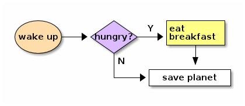

Ditaa
======
Dessiner des diagrammes en ascii art, c'est sympa et partique mais pas
très moderne au niveau du rendu.

Heureusement, il existe ditaa, un outil sous licence GPL qui permet de créer des
images à partir de diagrammes en ascii art, permettant ainsi le beau et
l'efficace.

		
~
